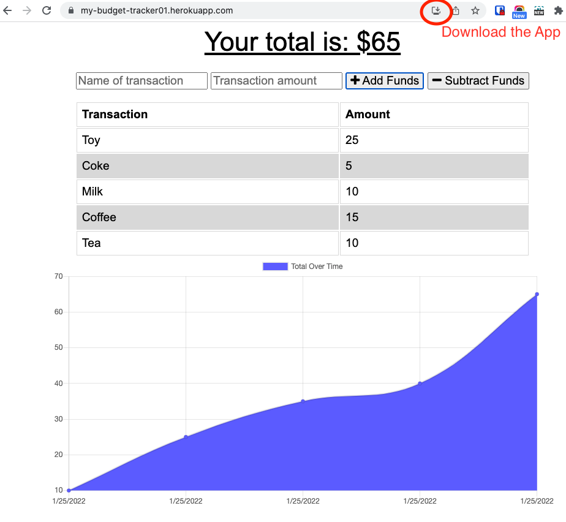

# Budget Tracker

## Table of Contents  
1. [Description](#description)
2. [Installation](#installation)
3. [Deployed](#deployed)

## Description  
A simple app to create and track a personal budget. This app will work while offline.

## Installation  
Extract all files, navigate in terminal to the directory with extracted files, then run 'npm i'.  

## Deployed
[Access the deployed web application here.](https://my-budget-tracker01.herokuapp.com/)

